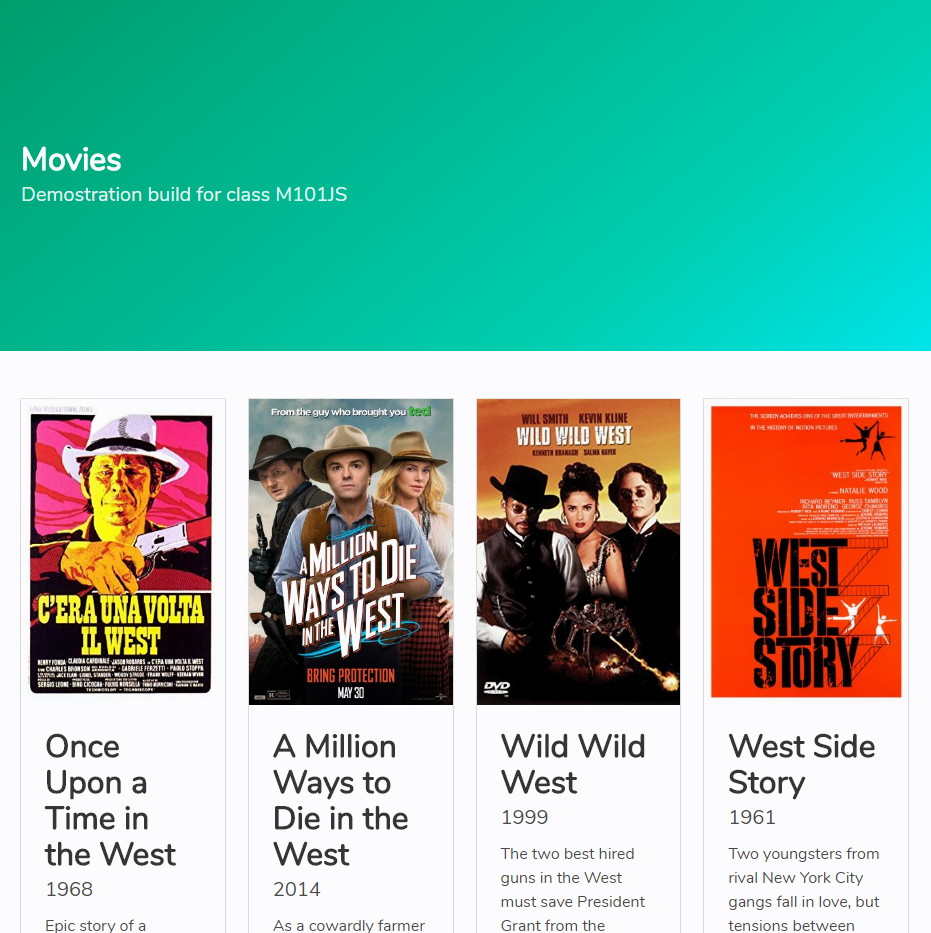

## Class 1: M101JS: MongoDB for Node.js Developers

---

This project is a result of the first class at the course M101JS from [MongoDB University](https://university.mongodb.com/).

This project uses [Node.js](https://nodejs.org/), [Express](http://expressjs.com), [ESLint](https://eslint.org/) and [Bulma Framework](https://bulma.io/).

To run this project you must:
- Create the .env file and set the variables. The MongoDB server must be running, otherwise the data from the project won't be imported.
- Install the npm packages using `npm install`.
- Run the project using `npm run dev`. The default port is 8000.

---

Print Screen:

